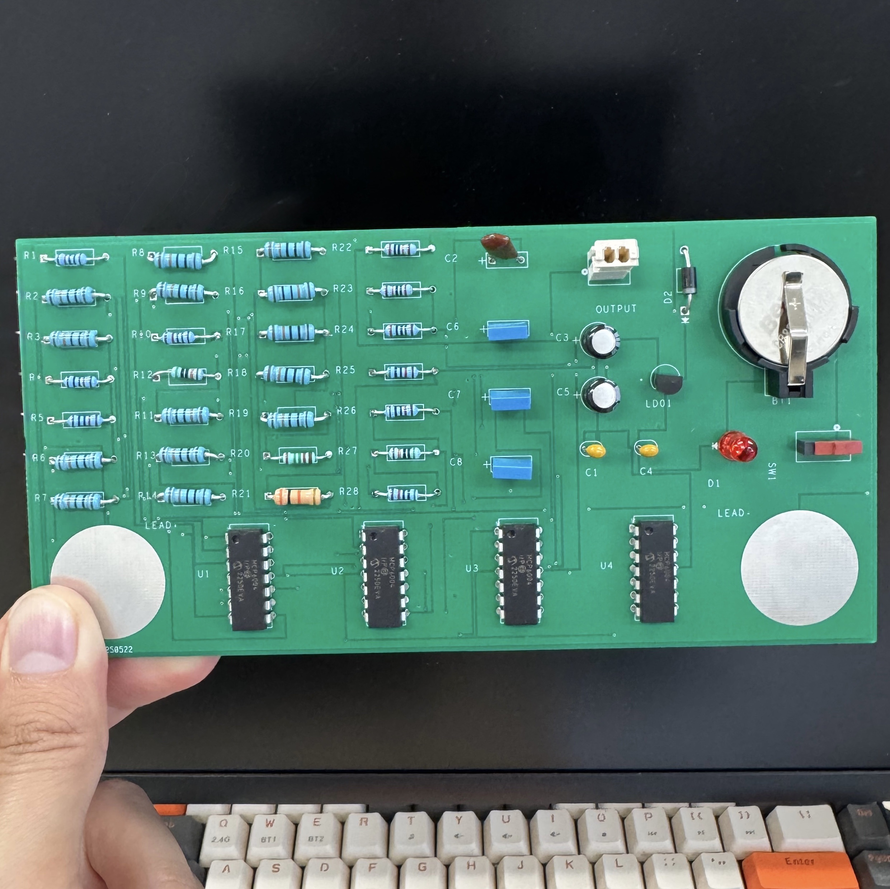
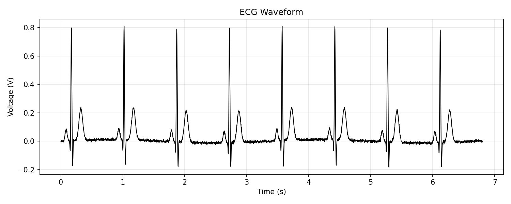

<div align="center">

# Minimalistic Finger ECG Board

### Compact ECG Acquisition & Custom PCB Design

*A biomedical electronics project — Department of Biomedical Engineering, Soonchunhyang University*




</div>

---

## Overview

A compact custom PCB for acquiring and conditioning electrocardiogram (ECG) signals from body-surface electrodes.

The board uses an **INA126 instrumentation amplifier** as the differential biopotential front-end and **MCP6004 operational amplifiers** for analog signal processing. The complete circuit was designed and fabricated through an **OrCAD schematic-to-PCB workflow** and validated by acquiring a real ECG waveform.

| | |
|---|---|
| Project Type | Biomedical Electronics / PCB Design |
| Signal | Electrocardiogram (ECG) |
| Front-End | INA126 Instrumentation Amplifier |
| Analog Processing | MCP6004 |
| PCB Design | OrCAD Capture / PCB Editor |
| Validation | Real-time ECG acquisition |

---

## Key Features

- Body-surface differential ECG acquisition
- INA126 instrumentation-amplifier front-end
- MCP6004 analog signal-conditioning stages
- Custom schematic, footprints, and PCB layout
- PCB routing and ground configuration
- Manufacturing artwork and NC Drill generation
- Real ECG waveform acquisition and hardware validation

---

## System Architecture


The electrodes detect the small potential difference produced by cardiac electrical activity. The INA126 provides differential amplification and common-mode rejection, while the following MCP6004 stages condition the signal before it reaches the analog output.

---

## Hardware

| Component | Part / Type | Function |
|---|---|---|
| Instrumentation Amplifier | INA126 | Differential biopotential amplification |
| Operational Amplifier | MCP6004 | Analog signal processing |
| Electrodes | Body-surface electrodes | ECG acquisition and reference |
| Resistors / Capacitors | Various | Gain, filtering, and conditioning |
| PCB | Custom design | Circuit integration |
| Oscilloscope | External | Waveform observation and validation |

---

## PCB Design

The circuit was developed using **Cadence OrCAD Capture and OrCAD PCB Editor**, progressing from schematic design to a manufacturable PCB.


The design process included:

- Schematic capture and component-library configuration
- Symbol and footprint assignment
- Pin-to-footprint verification
- Component placement and analog routing
- Ground configuration
- Layout verification
- NC Drill and artwork generation

Careful routing and grounding were important because ECG signals are low-amplitude and susceptible to common-mode and environmental interference.

---

## Experimental Result

The fabricated board was tested using body-surface electrodes, with the conditioned analog output recorded from the completed hardware.

<p align="center">
  
</p>

<p align="center">
  <sub>ECG waveform measured from the fabricated board.</sub>
</p>

The recorded waveform shows repeated cardiac cycles with prominent **R peaks** and visible **P-QRS-T morphology**, confirming successful acquisition and amplification of the cardiac biopotential signal.

This result validates the complete signal path:

```text
Body Electrodes → INA126 → Analog Conditioning → ECG Output
```

---

## Engineering Considerations

### Low-Amplitude Biosignal Acquisition

ECG signals are small compared with many environmental electrical signals. The instrumentation-amplifier front-end provides high input impedance, differential amplification, and common-mode rejection.

### Noise & Grounding

Signal quality can be affected by:

- 50/60 Hz mains interference
- Electrode contact
- Motion artifacts
- Power-supply noise
- Grounding
- PCB trace coupling

These factors were considered during circuit implementation, PCB routing, and hardware testing.

### PCB Implementation

The project also required translating the schematic into a physical design with correct component footprints, pin mappings, routing, clearances, and manufacturing outputs.

---

## Skills Demonstrated

| Area | Skills |
|---|---|
| Biomedical | ECG, biopotential acquisition, body-surface electrodes |
| Analog Electronics | Instrumentation amplifiers, op-amps, differential amplification, signal conditioning |
| PCB Design | OrCAD Capture, PCB Editor, footprints, routing, grounding, manufacturing files |
| Testing | Oscilloscope measurement, waveform analysis, circuit debugging |

---

## What I Learned

This project provided hands-on experience with the complete biomedical signal-acquisition chain, from physiological electrical activity to a measurable analog waveform.

It also demonstrated that reliable biosignal acquisition depends on more than amplifier gain. **Electrode contact, common-mode interference, grounding, analog conditioning, PCB layout, and measurement setup** all influence the final signal quality.

Most importantly, the project provided practical experience taking a biomedical circuit through the complete development cycle:

**Concept → Schematic → PCB → Fabrication → Physiological Signal Validation**

---

## Tech Stack

`ECG` · `Biomedical Electronics` · `INA126` · `MCP6004` · `Analog Signal Processing` · `OrCAD Capture` · `OrCAD PCB Editor` · `PCB Design` · `Oscilloscope`

---

## Repository Structure

```text
finger-ecg-board/
├── README.md
└── assets/
    ├── finger-ecg-board.jpg
    ├── schematic.png
    ├── pcb-layout.png
    └── ecg-waveform.png
```

---

## Author

**Thar Htet Nyan**  
Department of Biomedical Engineering  
Soonchunhyang University

---

<div align="center">
<sub>Academic biomedical electronics prototype. Not a certified medical diagnostic device.</sub>
</div>
